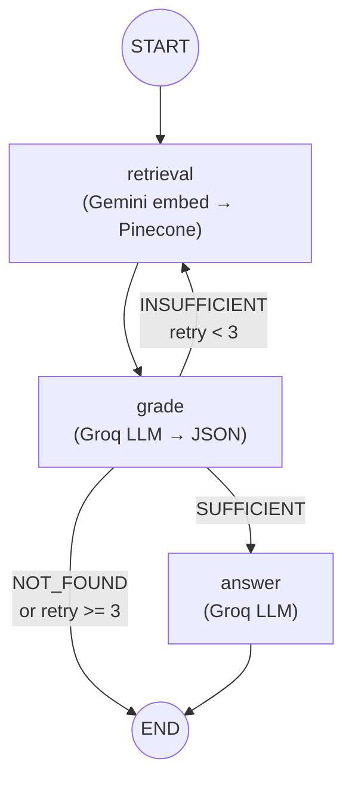

# Legixo Thinklabs — LangGraph Pipeline Documentation

## Architecture Overview

Legixo Thinklabs uses **LangGraph (StateGraph)** to orchestrate a multi-step Agentic RAG pipeline. The pipeline dynamically routes execution based on the relevance of retrieved legal document chunks, performing automatic query rewriting when retrieval quality is insufficient.



---

## Node Descriptions

### 1. `retrieval` Node
- **Function:** `retrieval(state: GraphState) -> dict`
- **Purpose:** Converts the input question or rewritten search query into a 768-dimensional vector using Google Gemini (`gemini-embedding-001`) and queries the Pinecone vector index (`legixo-corpus`).
- **Input Keys:** `question`, `search_query`
- **Output Keys:** `documents` (List of Pinecone match objects with text and source metadata)
- **Top K:** Retrieves `top_k=3` chunks per query to ensure selective, high-precision retrieval.

### 2. `grade` Node
- **Function:** `grade_documents(state: GraphState) -> dict`
- **Purpose:** Uses Groq's `openai/gpt-oss-120b` LLM in JSON Mode to evaluate whether retrieved document chunks contain sufficient information to answer the user's legal question.
- **Input Keys:** `documents`, `question`, `retry_count`
- **Output Keys:**
  - `grade`: `"SUFFICIENT"`, `"INSUFFICIENT"`, or `"NOT_FOUND"`
  - `grade_reason`: Textual justification for the grade
  - `search_query`: (Optional) Rephrased legal search query if graded `INSUFFICIENT`
  - `retry_count`: Incremented if `INSUFFICIENT`
- **Retry Guardrail:** If `retry_count >= 3` or `documents` is empty, short-circuits to `NOT_FOUND` to prevent infinite loops.

### 3. `answer` Node
- **Function:** `generate_answer(state: GraphState) -> dict`
- **Purpose:** Synthesizes a factual, grounded legal answer using ONLY the retrieved context documents via `openai/gpt-oss-120b`. Extracts source citations from document metadata.
- **Input Keys:** `question`, `documents`
- **Output Keys:** `answer`, `citations` (List of source filenames)
- **Grounding Guarantee:** Instructed to refuse answering and return a fallback string if the context is insufficient, preventing hallucinations.

---

## Routing Logic (`condition_for_route`)

| Evaluated Grade | Target Node | Next Action |
|---|---|---|
| `"SUFFICIENT"` | `answer` | Generates final answer with citations and terminates |
| `"INSUFFICIENT"` | `retrieval` | Re-embeds `search_query` (rewritten query) and loops |
| `"NOT_FOUND"` | `END` | Terminates with default fallback response |

---

## State Schema (`GraphState`)

The graph state is defined as a `TypedDict` in `app/state.py`:

```python
class GraphState(TypedDict, total=False):
    question: str                           # Original user question
    search_query: str                       # Rewritten search query for retry loops
    documents: List[Dict[str, Any]]         # Retrieved Pinecone vector matches
    grade: Literal["SUFFICIENT", "INSUFFICIENT", "NOT_FOUND"] # Relevance grade
    grade_reason: str                       # Justification for grade
    retry_count: int                        # Number of query rewrite attempts (max 3)
    answer: str                             # Final generated answer string
    citations: List[str]                    # Unique source filenames cited
    trace: Dict[str, Any]                   # Execution metadata for API response
```
